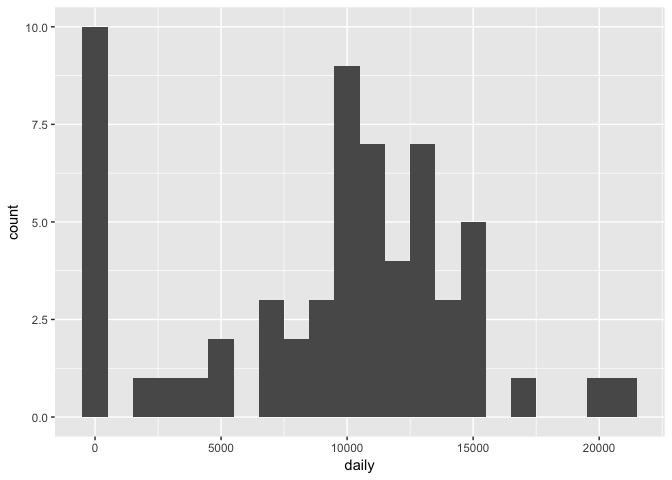
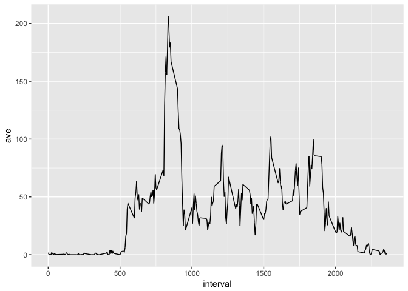
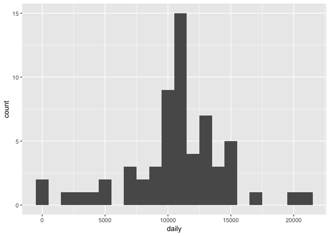
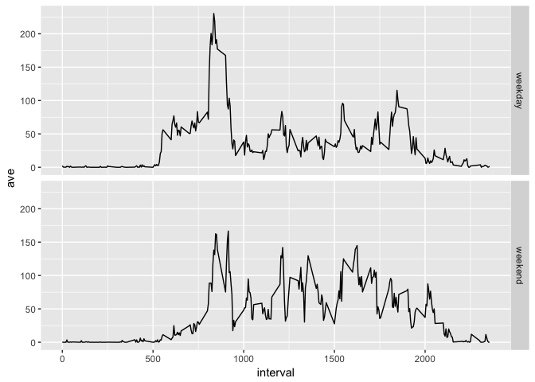

## Loading and preprocessing the data

```r
setwd("~/Desktop/R/ass/")
library(data.table)
library(lubridate)
```

```
## 
## Attaching package: 'lubridate'
```

```
## The following objects are masked from 'package:data.table':
## 
##     hour, isoweek, mday, minute, month, quarter, second, wday,
##     week, yday, year
```

```
## The following object is masked from 'package:base':
## 
##     date
```

```r
library(ggplot2)
activity <- fread("activity.csv")
activity[, date:=ymd(date, tz = "EST")]
```


## What is mean total number of steps taken per day?

```r
daily <- activity[, .(daily=sum(steps, na.rm = T)), by=date]
ggplot(data=daily, aes(x=daily)) + geom_histogram(binwidth=1000)
```

<!-- -->

```r
mean.daily <- round(mean(daily$daily))
median.daily <- round(median(daily$daily))
```
The mean of the total number of steps taken per day is 9354. 
The median of the total number of steps taken per day is 1.0395\times 10^{4}.


## What is the average daily activity pattern?

```r
activity[, ave:=mean(steps, na.rm = T), by=interval]
ggplot(data=activity, aes(x=interval, y=ave)) + geom_line()
```

<!-- -->

```r
max.steps <- activity[which.max(ave), interval]
```
The interval with the max number of steps on average across all the days is 835.


## Imputing missing values

```r
missing.vector <- is.na(activity$steps)
missing <- sum(is.na(activity$steps))
```
The total number of missing values in the dataset is 2304.

```r
activity[missing.vector, steps:=round(ave,0)]
```

```
## Warning in `[.data.table`(activity, missing.vector, `:=`(steps,
## round(ave, : Coerced 'double' RHS to 'integer' to match the column's
## type; may have truncated precision. Either change the target column to
## 'double' first (by creating a new 'double' vector length 17568 (nrows of
## entire table) and assign that; i.e. 'replace' column), or coerce RHS to
## 'integer' (e.g. 1L, NA_[real|integer]_, as.*, etc) to make your intent
## clear and for speed. Or, set the column type correctly up front when you
## create the table and stick to it, please.
```

```r
activity.no.na <- activity[,1:3]
daily.no.na <- activity.no.na[, .(daily=sum(steps)), by=date]
ggplot(data=daily.no.na, aes(x=daily)) + geom_histogram(binwidth=1000)
```

<!-- -->

```r
mean.daily.no.na <- round(mean(daily.no.na$daily))
median.daily.no.na <- round(median(daily.no.na$daily))
```
The mean of the total number of steps taken per day is 1.0766\times 10^{4}. 
The median of the total number of steps taken per day is 1.0762\times 10^{4}.
These values are slightly bigger than the estimates from the first part of the assignment. Imputing missing data resulted in slightly higher estimates of the total daily number of steps.


## Are there differences in activity patterns between weekdays and weekends?

```r
activity[, Day:=weekdays(date)]
activity[, category:="weekday"]
activity[grep(pattern="S", x=Day), category:="weekend"]
ave.5.by.weekday <- activity[, .(ave=mean(steps)), by=.(interval, category)]
ggplot(data=ave.5.by.weekday, aes(x=interval, y=ave)) + geom_line() + facet_grid(category~.)
```

<!-- -->

